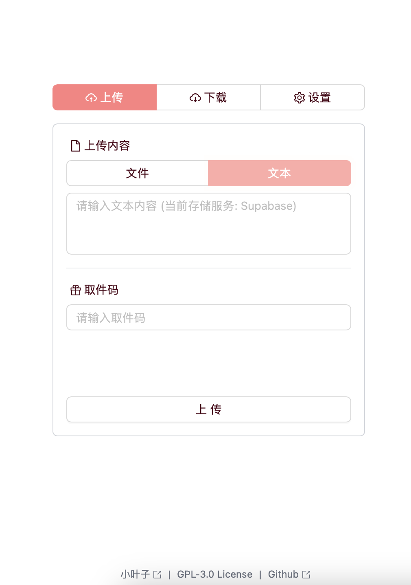
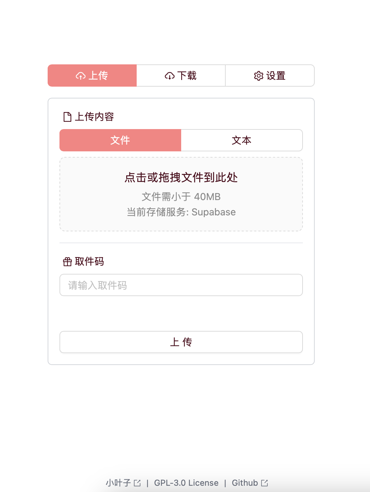
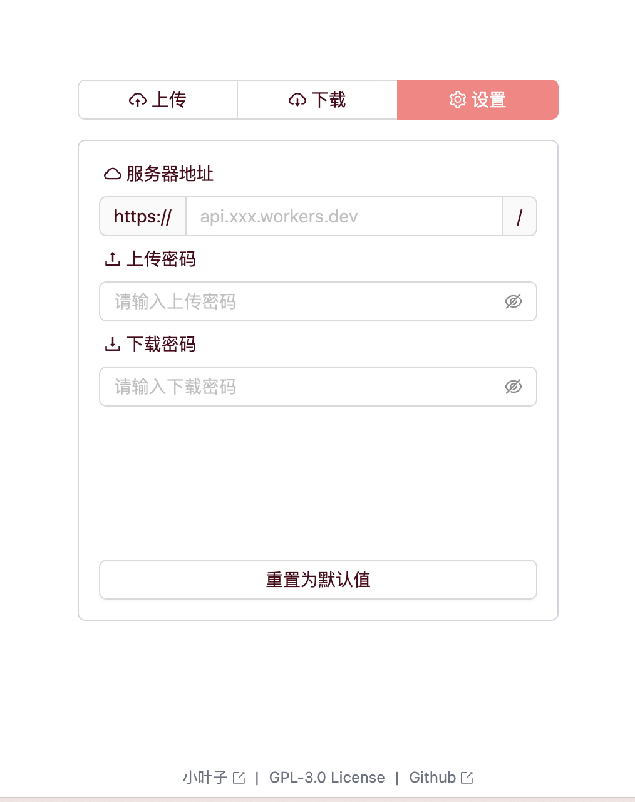

**基于 `Cloudflare R2` / `MongoDB Atlas` / `File0` 的零成本无服务器文件快递柜, 采用 `Next.js`、`WebSockets`, `React`, `Ant Design`, `Tailwind CSS`, `Hono` 等技术栈.**

**A serverless file delivery web app based on free `Cloudflare R2` / `MongoDB Atlas` / `File0` databases, using `Next.js`, `WebSockets`, `React`, `Ant Design`, `Tailwind CSS`, `Hono`, etc.**

||||
|:---:|:---:|:---:|

# Usage
使用方法

## 1 Install Dependencies
安装依赖

```bash
bun i
```

## 2 Local Development
本地开发

```bash
bun dev
```

## 3 Deploy
部署

### 3.1 Config Storage
You can use all the storage solutions while only one of them is required. And when using `R2`, you should deploy a separate server side project (not this `Next.js` project).

你可以同时使用所有存储解决方案, 但只需要其中一个. 当使用 `R2` 时, 你需要部署一个单独的服务端项目 (不是这个 `Next.js` 项目).

Above all, you should set `FILEBOX_UPLOAD_PW`, `FILEBOX_DOWNLOAD_PW` environment variables in `.env` file or `Vercel` no matter which storage solution you use.

不管使用哪种存储方案, 你都需要在 `.env` 文件或 `Vercel` 中设置 `FILEBOX_UPLOAD_PW`, `FILEBOX_DOWNLOAD_PW` 环境变量.

#### 3.1.1 For Cloudflare R2
如果使用 `R2`

See [this project](https://github.com/LeafYeeXYZ/MyAPIs).

见[此项目](https://github.com/LeafYeeXYZ/MyAPIs).

> Due to the limitation of max CPU time of the free plan of `Cloudflare Workers`, the maximum size of the file that can be uploaded is proximately 10MB when using `R2`.

> 由于 `Cloudflare Workers` 免费计划的最大 CPU 时间限制, 在使用 `R2` 时, 可上传的文件最大大小约为 10MB.

#### 3.1.2 For MongoDB
如果使用 `MongoDB`

Set `MONGODB_URI` environment variables in `.env` file or `Vercel`.

在 `.env` 文件或 `Vercel` 中设置 `MONGODB_URI` 环境变量.

#### 3.1.3 For [File0](https://file0.dev/) (Recommended)
如果使用 [`File0`](https://file0.dev/) (推荐)

Set `F0_SECRET_KEY` environment variable in `.env` file or `Vercel`.

在 `.env` 文件或 `Vercel` 中设置 `F0_SECRET_KEY` 环境变量.

### 3.2 Deploy to [Vercel](https://vercel.com/)
部署到 [Vercel](https://vercel.com/)

## 4 All Environment Variables
| Name | Description | Default | Required |
| :---: | :---: | :---: | :---: |
| `FILEBOX_UPLOAD_PW` | Upload Password | - | Yes |
| `FILEBOX_DOWNLOAD_PW` | Download Password | - | Yes |
| `MONGODB_URI` | MongoDB Connection URI | - | No |
| `F0_SECRET_KEY` | File0 Secret Key | - | No |
| `NEXT_PUBLIC_DEFAULT_SERVER` | Client Default R2 Server | - | No |
| `NEXT_PUBLIC_DEFAULT_UPLOAD_PW` | Client Default Upload Password | - | No |
| `NEXT_PUBLIC_DEFAULT_DOWNLOAD_PW` | Client Default Download Password | - | No |
| `NEXT_PUBLIC_DEFAULT_STORAGE` | Client Default Storage Server<br>`r2` / `mongodb` / `file0` | `r2` | No |

## 5 Frontend Config
| Name | Description |
| :---: | :---: |
| `R2 服务器地址` | See [3.1.1](#311-for-cloudflare-r2) |
| `上传密码` | For authentication, should be the same as the `FILEBOX_UPLOAD_PW` environment variable in the server side |
| `下载密码` | For authentication, should be the same as the `FILEBOX_DOWNLOAD_PW` environment variable in the server side |
| `存储服务器` | Storage Server |

## 6 Upload/Dowload Realtime Progress Support
上传/下载实时进度支持情况

| Storage | Upload | Download |
| :---: | :---: | :---: |
| `R2` | ✅ | ✅ |
| `MongoDB` | ❌ | ❌ |
| `File0` | ❌ | ✅ |
