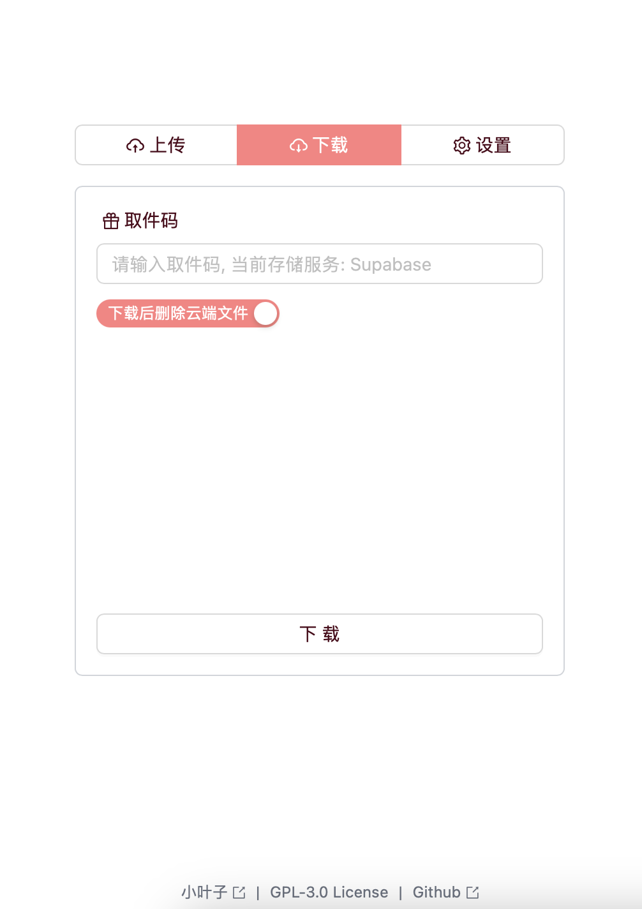

**基于 `Cloudflare R2` / `MongoDB Atlas` / `File0` 的零成本无服务器文件快递柜, 采用 `Next.js`、`WebSockets`, `React`, `Ant Design`, `Tailwind CSS`, `Hono` 等技术栈.**

**A serverless file delivery web app based on free `Cloudflare R2` / `MongoDB Atlas` / `File0` databases, using `Next.js`, `WebSockets`, `React`, `Ant Design`, `Tailwind CSS`, `Hono`, etc.**

||||
|:---:|:---:|:---:|

# Usage
使用方法

## Install Dependencies
安装依赖

```bash
bun i
```

## Local Development
本地开发

```bash
bun dev
```

## Build
构建

```bash
bun run build
```

## Deploy Server Side
部署服务端

You can use all the storage solutions while only one of them is required. And when using `R2`, you should deploy a separate server side project (not this `Next.js` project).

你可以同时使用所有存储解决方案, 但只需要其中一个. 当使用 `R2` 时, 你需要部署一个单独的服务端项目 (不是这个 `Next.js` 项目).

### For Cloudflare R2
如果使用 `R2`

See [this project](https://github.com/LeafYeeXYZ/MyAPIs).

见[此项目](https://github.com/LeafYeeXYZ/MyAPIs).

### For MongoDB
如果使用 `MongoDB`

Set `FILEBOX_UPLOAD_PW`, `FILEBOX_DOWNLOAD_PW`, `MONGODB_URI` environment variables in `.env` file or `Cloudflare Workers`, `Vercel`, etc.

在 `.env` 文件或 `Cloudflare Workers`, `Vercel` 等中设置 `FILEBOX_UPLOAD_PW`, `FILEBOX_DOWNLOAD_PW`, `MONGODB_URI` 环境变量.

### For File0
如果使用 `File0`

Set `F0_SECRET_KEY` environment variable in `.env` file or `Cloudflare Workers`, `Vercel`, etc.

在 `.env` 文件或 `Cloudflare Workers`, `Vercel` 等中设置 `F0_SECRET_KEY` 环境变量.

## Config Client
- `服务器地址`: Server Hostname.
- `上传密码`: Upload Password, should be the same as the `FILEBOX_UPLOAD_PW` environment variable in the server side.
- `下载密码`: Download Password, should be the same as the `FILEBOX_DOWNLOAD_PW` environment variable in the server side.
- `存储服务器`: Storage Server.

#### Note
Optioanlly, you can set `NEXT_PUBLIC_DEFAULT_SERVER` / `NEXT_PUBLIC_DEFAULT_UPLOAD_PW` / `NEXT_PUBLIC_DEFAULT_DOWNLOAD_PW` / `NEXT_PUBLIC_DEFAULT_STORAGE: 'r2' | 'mongodb' | 'file0'` environment variables in `.env` file or `Cloudflare Pages`, `Vercel`, etc.

可选在 `.env` 文件或 `Cloudflare Pages`, `Vercel` 等中设置 `NEXT_PUBLIC_DEFAULT_SERVER` / `NEXT_PUBLIC_DEFAULT_UPLOAD_PW` / `NEXT_PUBLIC_DEFAULT_DOWNLOAD_PW` / `NEXT_PUBLIC_DEFAULT_STORAGE: 'r2' | 'mongodb' | 'file0'` 环境变量.

# Known Issues
已知问题

Due to the limitation of max CPU time of the free plan of `Cloudflare Workers`, the maximum size of the file that can be uploaded is proximately 10MB when using `R2`.

由于 `Cloudflare Workers` 免费计划的最大 CPU 时间限制, 在使用 `R2` 时, 可上传的文件最大大小约为 10MB.

Due to the limitation of max document size of `MongoDB`, the maximum size of the file that can be uploaded is proximately 10MB when using `MongoDB`. (Sharding will be supported in the future)

由于 `MongoDB` 单个文档大小限制, 在使用 `MongoDB` 时, 可上传的文件最大大小也约为 10MB. (未来会支持分片上传)

The free plan of `File0` only has `100MB` storage space, recommend to check the `Delete after download` option.

`File0` 免费计划只有 `100MB` 的存储空间, 推荐勾选 `下载后删除` 选项.
